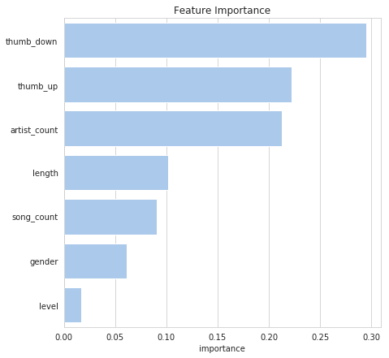

# Sparkify Project

Kaggle Kernel: https://www.kaggle.com/yukinagae/sparkify-project-churn-prediction

## Table of Contents

- [Sparkify Project](#sparkify-project)
  - [Table of Contents](#table-of-contents)
  - [Project Definition](#project-definition)
  - [Dependencies](#dependencies)
  - [Installation](#installation)
  - [Instructions](#instructions)
    - [Run Jupyter Notebook](#run-jupyter-notebook)
  - [Project Organization](#project-organization)
  - [Analysis](#analysis)
  - [Conclusion](#conclusion)

## Project Definition

This is a [Udacity nanodegree](https://www.udacity.com/course/data-scientist-nanodegree--nd025) project (Data Science Capstone).
This project uses users' event data from Sparkify, which is an imaginary digital music service similar to Spotify or Pandora, to build a model to predict users' churn.

## Dependencies

- Python3.6
- [Poetry](https://github.com/sdispater/poetry)

## Installation

```bash
cd sparkify-project
poetry install
```

## Instructions

### Run Jupyter Notebook

```bash
cd sparkify-project
poetry run jupyter notebook
```

## Project Organization

```text
[project root]
├── input
│   └── mini_sparkify_event_data.json
├── notebooks
│   └── Sparkify.ipynb
├── README.md
├── .gitignore
├── poetry.lock
└── pyproject.toml <- config file contains the project information and package dependencies etc.
```

## Analysis

The original size of the dataset is 12GB which is too large for my preliminary analysis, I used the small dataset (128MB) to perform data exploration process.

After doing EDA, I created the below features for later modeling part.

- artist: the number of artists
- gender: 0 or 1
- length: the total length
- level: 0 or 1
- page: the number of Thumbs Up / Thumbs Down
- song: the number of songs

I have used three machine learning models:

- Logistic Regression
- Random Forest classifier
- GBT classifier

As a result of the imbalanced dataset (`Churn` users are extremely few), Logistic Regression predicted zeros (`Not Churn`) for all the users and gives me F1 score 0.732. Even 

I decided to use this score as a baseline, and better scores than this baseline are necessary for further modeling.

Testing three machine learning models and Random Forest gives me the best score which is 0.738. According to the below feature importance provided by the Random Forest model, `Thumbs Up` and `Thumbs Down` seem to be important while the level of the users do not really matter.



## Conclusion

After proceeding hyperparameter tuning with the Random Forest model, the model has given me the below F1 score.

- F1 score: 0.7478

Since this modeling process is done for only the small subset of the dataset, more hyperparameter tuning might provide different results when using the original dataset. For production use, this task would be performed on cloud environments such as AWS or GCP to deal with the large dataset.
